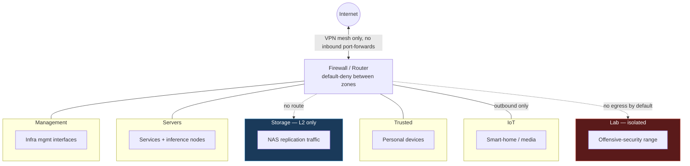

# Network Architecture

> **A note before you read this section.** This page describes the *segmentation model* — the design pattern and the security policy behind it — not the live network. Real subnet addressing, VLAN numbering, switch port assignments, router interface configuration, and management IPs are intentionally omitted. Even on private, non-routable address space, publishing an exact map of a live network hands an attacker who gains any foothold (a compromised IoT device, a malicious download, a phished client) a ready-made plan for lateral movement. The architecture is worth showing; the blueprint isn't.

## Segmentation model

The network is split into six purpose-built zones, each with a single job. Routing between zones is default-deny — only explicitly required traffic is allowed through, and every allowed path is intentional rather than incidental.

| Zone | Routing | Purpose |
|---|---|---|
| **Management** | Routed, admin-only | Infrastructure management interfaces (switch, firewall, out-of-band) |
| **Servers** | Routed | The always-on and wake-on-demand infrastructure nodes |
| **Storage** | L2 only, isolated from routing | NAS-to-NAS replication traffic, kept off the routed network entirely |
| **Trusted** | Routed | Personal devices — laptops, phones |
| **IoT** | Internet-only | Smart-home and media devices, no path to anything else internal |
| **Lab** | Isolated — no egress by default | Offensive-security range: vulnerable targets, malware-analysis sandbox |

## Firewall policy (source → destination)

`✓` = allowed · `✗` = denied by default · `adm` = admin source only, not general traffic

| From ↓ / To → | Management | Servers | Storage | Trusted | IoT | Lab | Internet |
|---|---|---|---|---|---|---|---|
| **Management** | — | ✓ | ✓ | ✓ | ✓ | ✓ | ✓ |
| **Servers** | ✗ | — | ✓ | ✗ | ✗ | ✗ | ✓ |
| **Storage** | ✗ | ✗ | — | ✗ | ✗ | ✗ | ✗ |
| **Trusted** | adm | ✓ | ✗ | — | ✗ | ✗ | ✓ |
| **IoT** | ✗ | ✗ | ✗ | ✗ | — | ✗ | ✓ |
| **Lab** | ✗ | ✗ | ✗ | ✗ | ✗ | — | ✗ |

The **Lab** zone is sealed in both directions by policy. Outbound internet access or a route to a target network is enabled only as an explicit, temporary rule during an active exercise, then removed immediately after.

## Remote access

- Access to internal services is over an encrypted VPN mesh (WireGuard-based), not inbound port-forwards. Inbound forwards to the router are kept at zero wherever possible.
- DNS-based ad/tracker blocking runs on a dedicated low-power node so name resolution survives a reboot of any other service host.
- Intrusion detection/prevention runs inline at the network edge, with alerts shipped to the SIEM for correlation.

## Switching

A managed L2 switch handles VLAN trunking between zones; all inter-VLAN routing and policy enforcement happens at the firewall, not the switch — keeping the switch's job simple (segmentation) and the firewall's job explicit (policy). Unused ports are administratively shut down by default.
